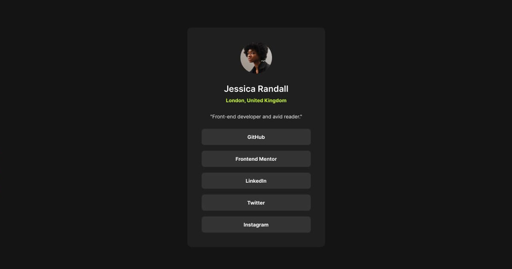

# Frontend Mentor - Social links profile solution

This is a solution to the [Social links profile challenge on Frontend Mentor](https://www.frontendmentor.io/challenges/social-links-profile-UG32l9m6dQ). 

## Table of contents

- [Overview](#overview)
  - [The challenge](#the-challenge)
  - [Screenshot](#screenshot)
  - [Links](#links)
- [Author](#author)
- [Version Control](#version-control)
- [To Do](#to-do)

## Overview

### The challenge

Users should be able to:

- See hover and focus states for all interactive elements on the page

### Screenshot

### Links

- Solution URL: [https://github.com/4uwebsite/Social-links-profile](https://github.com/4uwebsite/Social-links-profile)
- Live Site URL: [https://4uwebsite.github.io/Social-links-profile/](https://4uwebsite.github.io/Social-links-profile/)

## Author

- Website - [https://4uwebsite.github.io](https://4uwebsite.github.io)
- Frontend Mentor - [@4uwebsite](https://www.frontendmentor.io/profile/4uwebsite)

## Version Control
- 1.0.3 - [STABLE RELEASE] Testing & Bug Fixes.
- 1.0.2 - Responsive.
- 1.0.1 - Refactored.
- 1.0.0 - Non refactored code.

## To Do
- [x] Update ReadMe.
- [x] Testing.
- [x] Make responsive.